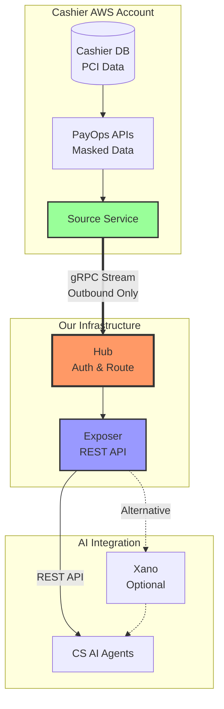

# Secure Cashier Data Access for CS AI Agents

## Problem

CS AI agents need Cashier payment data. Current blockers:
- Full DB replication pending PCI compliance
- Direct external connections from Cashier AWS too risky
- PayOps APIs exist with proper masking but need secure exposure

## Solution: DataHub

A controlled gateway that exposes PayOps APIs to AI agents securely.

**Three components:**
- **Source** - Data connector (deployed in Cashier AWS, connects to PayOps APIs)
- **Hub** - Access controller (validates who can access what)
- **Exposer** - API endpoint (provides REST API to AI agents)

## How It Works

1. **Source** in Cashier AWS calls PayOps APIs (existing masked data)
2. **Hub** in our infra authenticates and routes queries
3. **Exposer** provides REST API to AI agents (or Xano)

**Key point:** Source initiates outbound connection. No inbound ports to Cashier AWS.

## Security & Benefits

- Uses existing PayOps masking (no new sensitive data exposure)
- Unique token per component (Source, Hub, Exposer, each AI agent)
- All data access defined as functions in code (GitHub, versioned, reviewable by security team)
- Security team can review and approve each operation before deployment
- Complete audit log (who requested what, when)
- No direct DB access
- Works with existing PayOps APIs
- Deploy Source in Cashier AWS without infrastructure changes
- Full control over what AI agents can access
- Source initiates outbound connection only (no inbound ports to Cashier AWS)

## Technical Status

Working prototype implemented. Tested with PostgreSQL and REST API data sources.